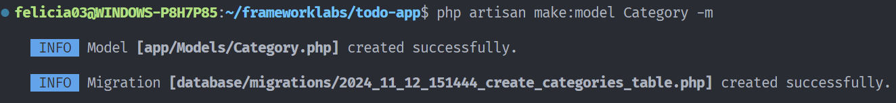

# Lucrarea de laborator nr. 3. Bazele lucrului cu baze de date în Laravel

## Scopul Lucrării

Familiarizarea cu principiile de bază ale lucrului cu baze de date în Laravel. Învățarea creării de migrații, modele și seed-uri pe baza aplicației web `To-Do App`.

## Condiții

În cadrul acestei lucrări de laborator, veți continua dezvoltarea aplicației `To-Do App` pentru echipe, începută în lucrările de laborator anterioare.

Veți adăuga funcționalitatea de lucru cu baza de date, veți crea modele și migrații, veți configura relațiile dintre modele și veți învăța să utilizați fabrici și seed-uri pentru generarea datelor de testare.

## №1. Pregătirea pentru lucru

## Pași realizați pentru configurarea bazei de date:

1. Instalarea MySQL pe WSL
   Am instalat MySQL pe Windows Subsystem for Linux (WSL) pentru a avea un SGBD dedicat care să ruleze pe sistemul de operare.

2. Lansarea procesului MySQL în background
   Am configurat MySQL să ruleze în background, pe portul specificat în fișierul `.env` (3306), pentru a asigura conectivitatea aplicației.

3. Configurarea variabilelor de mediu în fișierul `.env`
   În fișierul `.env`, am configurat variabilele de mediu pentru a conecta aplicația la baza de date:

```
DB_CONNECTION=mysql
DB_HOST=127.0.0.1
DB_PORT=3306
DB_DATABASE=todo_app
DB_USERNAME=root
DB_PASSWORD=root
```

## №2. Crearea modelelor și migrațiilor

1.  Creați modelul Category — categoria unei sarcini.

        - `php artisan make:model Category -m`

    

2.  Definirea structurii tabelei category în migrație:

Adăugați câmpuri:

-   id — cheia primară;
-   name — numele categoriei;
-   description — descrierea categoriei;
-   created_at — data creării categoriei;
-   updated_at — data actualizării categoriei.

În interiorul fișierului de migrație pentru modelul `Category` din folderul `database/migrations`creat automat de Laravel am definit structura tabelului :

```php
public function up(): void
   {
     Schema::create('categories', function (Blueprint $table) {
         $table->id(); //cheia primara
         $table->string('name');  // numele categoriei
         $table->text('description')->nullable();  // descrierea categoriei
         $table->timestamps(); //timpul si data de actualizare
   });
   }
```

Tot odată pentru a preveni atacurile de tip _mass assignment_ am utilizat variabila `$fillable` în În modelul `Category` (fișierul `app/Models/Category.php`) pentru a specifica exact care câmpuri sunt permise pentru atribuire în masă, reducând riscul de acces neautorizat la alte câmpuri.

`protected $fillable = ['name', 'description'];`

3. Creați modelul Task — sarcina.

`php artisan make:model Task -m`

4. Definirea structurii tabelei task în migrație:

Adăugați câmpuri:

-   id — cheia primară;
-   title — titlul sarcinii;
-   description — descrierea sarcinii;
-   created_at — data creării sarcinii;
-   updated_at — data actualizării sarcinii.

```php
public function up(): void
    {
        Schema::create('tasks', function (Blueprint $table) {
            $table->id();
            $table->string('title');
            $table->text('description')->nullable();
            $table->timestamps();
        });
    }
```

Adăugaarea câmpului `$fillable` :
`protected $fillable = ['title', 'description'];`

5. Rulați migrarea pentru a crea tabelele în baza de date:

-   `php artisan migrate`

6. Creați modelul `Tag` — eticheta unei sarcini.

`php artisan make:model Tag -m`

7. Definirea structurii tabelei **tag** în migrație:

    Adăugați câmpuri:

    - id — cheia primară;
    - name — numele etichetei;
    - created_at — data creării etichetei;
    - updated_at — data actualizării etichetei.

```php
public function up(): void
    {
        Schema::create('tags', function (Blueprint $table) {
            $table->id();
            $table->string('name');
            $table->timestamps();
        });
    }
```

Adăugaarea câmpului `$fillable` :
`protected $fillable = ['name'];`

8. Adăugați câmpul $fillable în modelele Task, Category și Tag pentru a permite atribuirea în masă a datelor.

## №3. Relația dintre tabele
