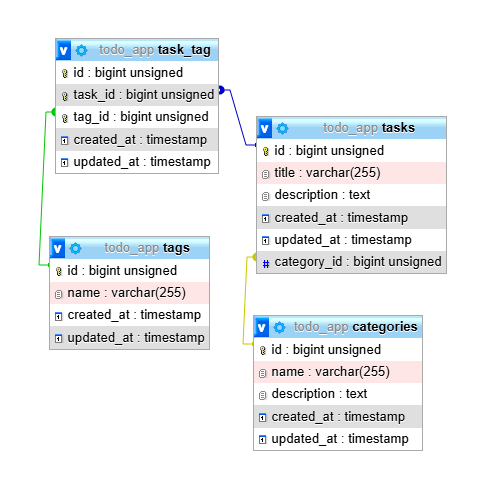

# Lucrarea de laborator nr. 3. Bazele lucrului cu baze de date în Laravel

## Scopul Lucrării

Familiarizarea cu principiile de bază ale lucrului cu baze de date în Laravel. Învățarea creării de migrații, modele și seed-uri pe baza aplicației web `To-Do App`.

## Condiții

În cadrul acestei lucrări de laborator, veți continua dezvoltarea aplicației `To-Do App` pentru echipe, începută în lucrările de laborator anterioare.

Veți adăuga funcționalitatea de lucru cu baza de date, veți crea modele și migrații, veți configura relațiile dintre modele și veți învăța să utilizați fabrici și seed-uri pentru generarea datelor de testare.

## №1. Pregătirea pentru lucru

## Pași realizați pentru configurarea bazei de date:

1. Instalarea MySQL pe WSL
   Am instalat MySQL pe Windows Subsystem for Linux (WSL) pentru a avea un SGBD dedicat care să ruleze pe sistemul de operare.

2. Lansarea procesului MySQL în background
   Am configurat MySQL să ruleze în background, pe portul specificat în fișierul `.env` (3306), pentru a asigura conectivitatea aplicației.

3. Configurarea variabilelor de mediu în fișierul `.env`
   În fișierul `.env`, am configurat variabilele de mediu pentru a conecta aplicația la baza de date:

```
DB_CONNECTION=mysql
DB_HOST=127.0.0.1
DB_PORT=3306
DB_DATABASE=todo_app
DB_USERNAME=root
DB_PASSWORD=root
```

## №2. Crearea modelelor și migrațiilor

1.  Creați modelul Category — categoria unei sarcini.

        - `php artisan make:model Category -m`

    

2.  Definirea structurii tabelei category în migrație:

Adăugați câmpuri:

-   id — cheia primară;
-   name — numele categoriei;
-   description — descrierea categoriei;
-   created_at — data creării categoriei;
-   updated_at — data actualizării categoriei.

În interiorul fișierului de migrație pentru modelul `Category` din folderul `database/migrations`creat automat de Laravel am definit structura tabelului :

```php
public function up(): void
   {
     Schema::create('categories', function (Blueprint $table) {
         $table->id(); //cheia primara
         $table->string('name');  // numele categoriei
         $table->text('description')->nullable();  // descrierea categoriei
         $table->timestamps(); //timpul si data de actualizare
   });
   }
```

Tot odată pentru a preveni atacurile de tip _mass assignment_ am utilizat variabila `$fillable` în În modelul `Category` (fișierul `app/Models/Category.php`) pentru a specifica exact care câmpuri sunt permise pentru atribuire în masă, reducând riscul de acces neautorizat la alte câmpuri.

`protected $fillable = ['name', 'description'];`

3. Creați modelul Task — sarcina.

`php artisan make:model Task -m`

4. Definirea structurii tabelei task în migrație:

Adăugați câmpuri:

-   id — cheia primară;
-   title — titlul sarcinii;
-   description — descrierea sarcinii;
-   created_at — data creării sarcinii;
-   updated_at — data actualizării sarcinii.

```php
public function up(): void
    {
        Schema::create('tasks', function (Blueprint $table) {
            $table->id();
            $table->string('title');
            $table->text('description')->nullable();
            $table->timestamps();
        });
    }
```

Adăugaarea câmpului `$fillable` :
`protected $fillable = ['title', 'description'];`

5. Rulați migrarea pentru a crea tabelele în baza de date:

-   `php artisan migrate`

6. Creați modelul `Tag` — eticheta unei sarcini.

`php artisan make:model Tag -m`

7. Definirea structurii tabelei **tag** în migrație:

    Adăugați câmpuri:

    - id — cheia primară;
    - name — numele etichetei;
    - created_at — data creării etichetei;
    - updated_at — data actualizării etichetei.

```php
public function up(): void
    {
        Schema::create('tags', function (Blueprint $table) {
            $table->id();
            $table->string('name');
            $table->timestamps();
        });
    }
```

Adăugaarea câmpului `$fillable` :
`protected $fillable = ['name'];`

8. Adăugați câmpul $fillable în modelele Task, Category și Tag pentru a permite atribuirea în masă a datelor.

## №3. Relația dintre tabele

1. Creați o migrare pentru a adăuga câmpul `category_id` în tabela _task_.

    - `php artisan make:migration add_category_id_to_tasks_table --table=tasks`
    - Definiți structura câmpului category_id și adăugați cheia externă pentru a face legătura cu tabela
      `category`.

Codul adaugat în fișierul migrației nou create în `database/migrations` :

```php
public function up(): void
    {
        Schema::table('tasks', function (Blueprint $table) {
            $table->unsignedBigInteger('category_id')->nullable(); // câmpul category_id
            $table->foreign('category_id')->references('id')->on('categories')->onDelete('set null'); // cheia externă
        });
    }
```

```php
public function down(): void
    {
        Schema::table('tasks', function (Blueprint $table) {
            $table->dropForeign(['category_id']);  // elimină cheia externă
        $table->dropColumn('category_id');    // elimină câmpul category_id
        });
    };
```

Aceasta va adăuga câmpul `category_id` în tabela `tasks` și va crea o relație de tipul `many-to-one` între `tasks` și `categories`.

2. Creați o tabelă intermediară pentru relația de tipul multe-la-multe dintre sarcini(tasks) și etichete(tags):

    - `php artisan make:migration create_task_tag_table`

3. Definirea structurii corespunzătoare a tabelei în migrație.

    - Această tabelă trebuie să lege sarcinile și etichetele prin identificatorii lor.
    - Exemplu: `task_id` și `tag_id`: sarcina 10 este legată de eticheta 5.

```php
public function up(): void
    {
        Schema::create('task_tag', function (Blueprint $table) {
            $table->id();
            $table->unsignedBigInteger('task_id');  // câmpul pentru id-ul sarcinii
            $table->unsignedBigInteger('tag_id');   // câmpul pentru id-ul etichetei
            $table->timestamps();

        $table->foreign('task_id')->references('id')->on('tasks')->onDelete('cascade'); // relație cu tasks
        $table->foreign('tag_id')->references('id')->on('tags')->onDelete('cascade');   // relație cu tags

        // Definirea unui index unic pentru a preveni duplicatele
        $table->unique(['task_id', 'tag_id']);
        });
    }
```

Aceasta va crea o tabelă intermediară care leagă `tasks` și `tags` prin câmpurile `task_id` și `tag_id`. De asemenea, sunt stabilite relațiile corespunzătoare pentru ștergerea în cascadă a înregistrărilor.

4. Rulați migrarea pentru a crea tabela în baza de date.
   

    

## №4. Relațiile dintre modele

1. Adăugați relații în modelul `Category` (O categorie poate avea multe sarcini)

    - Deschideți modelul Category și adăugați metoda:

```php
   public function tasks()
   {
   return $this->hasMany(Task::class);
   }
```

2. Adăugați relații în modelul Task

    - Sarcina este legată de o categorie.
    - Sarcina poate avea multe etichete.

    Am adaugat relația `belongsTo` pentru a indica că o sarcină este asociată unei categorii.

    Am adaugat și relația belongsToMany pentru a lega sarcinile de etichete (relația `many-to-many`):

```php
public function category()
{
    return $this->belongsTo(Category::class);
}

public function tags()
{
    return $this->belongsToMany(Tag::class);
}
```

3. Adăugați relații în modelul Tag (O etichetă poate fi legată de multe sarcini).

    Adaugă metodei `tasks()` pentru a defini relația `many-to-many`:

    ```php
    public function tasks()
    {
     return $this->belongsToMany(Task::class);
    }

    ```

4. Adăugați câmpurile corespunzătoare în `$fillable` ale modelelor.

    - În Category.php:

`protected $fillable = ['name', 'description'];`

-   În Task.php:

`protected $fillable = ['title', 'description', 'category_id'];`

Adăugarea lui `category_id` în câmpul `$fillable` al modelului `Task` este necesară pentru că acest câmp reprezintă legătura între `Task` și `Category`.

-   În Tag.php:

`protected $fillable = ['name'];`

## №5. Crearea fabricilor și seed-urilor

1. Creați o fabrică pentru modelul `Category`:

    - `php artisan make:factory CategoryFactory --model=Category`
    - Definiți structura datelor pentru generarea categoriilor.

```php

namespace Database\Factories;

use App\Models\Category;
use Illuminate\Database\Eloquent\Factories\Factory;
use Faker\Generator as Faker;

class CategoryFactory extends Factory
{
    protected $model = Category::class;

    public function definition()
    {
        return [
            'name' => $this->faker->word,
            'description' => $this->faker->sentence,
        ];
    }
}

```

Acest cod va genera 10 categorii fictive, fiecare cu câmpurile `name` și `description` completate automat folosind `Faker`.

2. Creați o fabrică pentru modelul `Task`.
   `php artisan make:factory TaskFactory --model=Task`

```php
namespace Database\Factories;

use App\Models\Task;
use App\Models\Category;
use Illuminate\Database\Eloquent\Factories\Factory;
use Faker\Generator as Faker;

class TaskFactory extends Factory
{
    protected $model = Task::class;

    public function definition()
    {
        return [
            'title' => $this->faker->sentence,
            'description' => $this->faker->paragraph,
            'category_id' => Category::factory(), // Asociere cu o categorie generată
        ];
    }
}

```

Acest cod va genera 10 sarcini, fiecare având câmpurile `title` și `description` completate și asociate unei categorii fictive prin `category_id`.

3. Creați o fabrică pentru modelul `Tag`.
   `php artisan make:factory TagFactory --model=Tag`

```php
namespace Database\Factories;

use App\Models\Tag;
use Illuminate\Database\Eloquent\Factories\Factory;
use Faker\Generator as Faker;

class TagFactory extends Factory
{
    protected $model = Tag::class;

    public function definition()
    {
        return [
            'name' => $this->faker->word,
        ];
    }
}

```

Acest cod va genera 10 tag-uri, fiecare având câmpul `name` completat cu un cuvânt fictiv.

4. Creați seed-uri pentru a popula tabelele cu date inițiale pentru modelele `Category`, `Task`, `Tag`.

`php artisan make:seeder CategorySeeder`

```php
use App\Models\Category;

public function run()
{
    Category::factory()->count(10)->create();
}

```

`php artisan make:seeder TaskSeeder`

```php
use App\Models\Task;

public function run()
{
    Task::factory()->count(50)->create();
}

```

`php artisan make:seeder TagSeeder`

```php
use App\Models\Tag;

public function run()
{
    Tag::factory()->count(20)->create();
}

```

5. Actualizați fișierul `DatabaseSeeder` pentru a lansa seed-urile și rulați-le:

```php
use Illuminate\Database\Seeder;

use App\Models\Category;
use App\Models\Task;
use App\Models\Tag;

public function run()
{
    $this->call([
        CategorySeeder::class,
        TaskSeeder::class,
        TagSeeder::class,
    ]);
}

```

`php artisan db:seed`

Urmând acești pași am creat date fictive pentru modelele `Category`, `Task` și `Tag` în baza de date, pentru a putea lucra cu ele mai departe în aplicație.

## №6. Lucrul cu controlere și vizualizări

1. Deschideți controlerul `TaskController` (`app/Http/Controllers/TaskController.php`).

2. Actualizați metoda index pentru a obține lista sarcinilor din baza de date.

    - Folosiți modelul `Task` pentru a obține toate sarcinile.

Inițial, metoda `index` folosea o listă statică de sarcini (un array definit manual) pentru a trimite datele către vizualizare. Codul inițial arăta astfel:

```php
public function index()
{
    $tasks = [
        ['id' => 1, 'title' => 'Cumpărături'],
        ['id' => 2, 'title' => 'Spălat mașina'],
        ['id' => 3, 'title' => 'Finalizat proiect'],
    ];

    return view('tasks.index', ['tasks' => $tasks]);
}

```

Aceasta afișa datele din array în vizualizarea `tasks.index`.

După modificare, metoda index arată astfel:

```php
public function index()
{
    $tasks = Task::with(['category', 'tags'])->get();

    return view('tasks.index', compact('tasks'));
}

```

În aceast mod:

-   Array-ul static a fost înlocuit cu datele obținute din baza de date.
-   Metoda încearcă să preia toate sarcinile existente din tabelul `tasks` din baza de date (inclusiv relațiile `category` și `tags`).

3. Actualizați metoda `show` pentru a afișa o sarcină individuală.

    - Afișați informațiile despre sarcină după identificatorul acesteia.
    - **Obligatoriu** afișați categoria și etichetele sarcinii.

Codul original al metodei `show`:

```php
public function show($id)
{
    $task = [
        'id' => $id,
        'title' => 'Titlul sarcinii',
        'description' => 'Aceasta este descrierea detaliată a sarcinii.',
        'created_at' => now()->subDays(2)->format('d-m-Y'),
        'updated_at' => now()->format('d-m-Y'),
        'status' => false, // sarcina nu este finalizată
        'priority' => 'medie',
        'assigned_to' => 'John Doe'
    ];

    return view('tasks.show', ['task' => $task]);
}

```

În acest caz:

-   Sarcina era definită manual ca un array static, folosind `$id` ca identificator.
-   Detaliile (cum ar fi titlul, descrierea, data creării etc.) erau pur fictive și hardcodate în metoda `show`.
-   Nu se folosea deloc baza de date, iar datele erau mereu aceleași pentru orice `id`.

După modificare, metoda `show` folosește modelul `Task` pentru a obține datele unei sarcini din baza de date:

```php
public function show($id)
{
    $task = Task::with(['category', 'tags'])->findOrFail($id);

    return view('tasks.show', compact('task'));
}

```

Acum:

-   **Datele sunt preluate din baza de date**:
    În loc să folosească un array static, metoda folosește modelul `Task` pentru a găsi sarcina cu ID-ul specificat în baza de date.

-   **Relațiile sunt încărcate**:
    Folosind `with(['category', 'tags'])`, metoda adaugă și datele din tabelele asociate (`category` și `tags`), ceea ce permite accesarea informațiilor suplimentare despre sarcină.

-   **Gestionează erorile automat**:
    Metoda `findOrFail($id)` verifică dacă sarcina cu ID-ul specificat există. Dacă nu există, Laravel va arunca automat o eroare 404 (Not Found).

4. În metodele `index` și `show`, folosiți metoda with (**Eager Loading**) pentru a încărca modelele asociate.

La punctele anterioare am folosit`with(['category', 'tags'])` pentru a încărca relațiile. Acesta este un exemplu de Eager Loading care reduce numărul de interogări și aduce datele asociate într-o singură interogare.

5. Actualizați vizualizările corespunzătoare pentru a afișa lista de sarcini și o sarcină individuală.

Inițial, fișierul`index.blade.php`afișa doar titlul sarcinilor preluate dintr-un array static. După modificările în controler, datele sunt acum preluate din baza de date, iar fiecare sarcină conține relațiile sale.

În urma modificărilor:

-   **Accesarea relațiilor `category` și `tags`**:
    Am adăugat afișarea categoriei și a etichetelor pentru fiecare sarcină. Relațiile sunt accesibile acum datorită `with(['category', 'tags'])` din metoda `index` din `TaskController`.

```php
<p><strong>Category:</strong> {{ $task->category->name ?? 'None' }}</p>
@foreach ($task->tags as $tag)
    <span>{{ $tag->name }}</span>
@endforeach

```

-   **Datele sunt dinamice, nu statice**:
    În versiunea veche, sarcinile erau hardcodate ca un array static. Acum, sarcinile sunt preluate din baza de date, iar accesul la date se face prin obiectele returnate de model.

```php
<a href="{{ route('tasks.show', $task->id) }}">
    {{ $task->title }}
</a>

```

-   **Schimbarea modului de iterare**:
    Iterația inițială folosea $task['title'] pentru a accesa datele din array-uri. Acum, folosim `$task->title`, deoarece datele sunt obiecte Eloquent și nu array-uri.

```php
@foreach ($tasks as $task)
    {{ $task->title }}
@endforeach

```

-   **Verificarea relațiilor goale**:
    Pentru a preveni erorile în cazul în care o sarcină nu are o categorie asociată, am adăugat o verificare pentru a afișa "None" dacă relația `category` este null.

```php
{{ $task->category->name ?? 'None' }}

```

Inițial fișierul `show.blade.php` este destinat afișării unei liste de sarcini (similar cu `index.blade.php`), așa că trebuie să-l rescriem pentru afișarea unei singure sarcini. Conform noilor cerințe, trebuie să-l transformăm astfel încât să afișeze detaliile unei sarcini individuale ('$task') și să integreze datele din relațiile `category` și `tags`.

În urma modificărilor:

-   **Schimbarea scopului vizualizării**:

Fișierul inițial afișa o listă de sarcini printr-un loop (`@foreach`). Pentru `show.blade.php`, trebuie să afișăm detaliile unei singure sarcini (`$task`), deoarece metoda `show` din controller transmite un singur obiect în view.

-   **Afișarea atributelor individuale**:

Titlul și descrierea sarcinii: Sunt afișate utilizând proprietățile modelului `$task`.

```php
<h1 class="text-3xl font-bold text-gray-800 mb-4">{{ $task->title }}</h1>
<p class="text-gray-600 mb-4">{{ $task->description }}</p>
```

-   **Categoria sarcinii**:
    Relația `category` este accesată prin `$task->category->name`, iar dacă sarcina nu are categorie, se afișează `None` folosind operatorul null coalescing (`??`).

```php
<p><strong>Category:</strong> {{ $task->category->name ?? 'None' }}</p>
```

-   **Afișarea etichetelor (tags)**:

Etichetele sunt afișate sub formă de "bule" stilizate folosind un loop (`@foreach`) și clase CSS.
blade

```php
@foreach ($task->tags as $tag)
    <span class="bg-blue-100 text-blue-800 px-2 py-1 rounded-full text-xs">{{ $tag->name }}</span>
@endforeach
```

-   **Datele de creare și actualizare**:

Folosim `created_at` și `updated_at` pentru a afișa datele formatate corespunzător. Metoda `format('d-m-Y H:i')` convertește timestamp-ul într-un format ușor de citit.

```php
<p><strong>Created at:</strong> {{ $task->created_at->format('d-m-Y H:i') }}</p>
<p><strong>Last updated:</strong> {{ $task->updated_at->format('d-m-Y H:i') }}</p>
```

**Conceptele de separare a responsabilităților (Single Responsibility)**

-   Fiecare vizualizare (`index`, `show`, etc.) are un scop clar.
-   `index.blade.php`: este destinat afișării listei de sarcini.
-   `show.blade.php`: este destinat afișării unei sarcini individuale.
    Dacă încercăm să îmbinăm ambele funcționalități (să afișăm și lista de sarcini printr-un `@foreach`, și detaliile unei singure sarcini (`$task`) simultan) într-un singur fișier (`show.blade.php`), încalcăm principiul separării responsabilităților, ceea ce duce la confuzie și cod greu de întreținut.

6. Actualizați metoda `create` pentru a afișa formularul de creare a unei sarcini și metoda store pentru a salva o sarcină nouă în baza de date.

    - **Notă**: Deoarece nu ați studiat încă formularele, folosiți obiectul Request pentru a obține datele. **De exemplu**:

```php
$request->input('title');
// sau
$request->all();
```

7. Actualizați metoda `edit` pentru a afișa formularul de editare a unei sarcini și metoda `update` pentru a salva modificările în baza de date.

8. Actualizați metoda `destroy` pentru a șterge o sarcină din baza de date.

## Sarcini Suplimentare

1. Creați modelul `Comment` pentru comentariile sarcinilor.

    - Adăugați câmpurile corespunzătoare în migrare.
    - Creați relații între modelele Task și Comment.

2. Adăugați posibilitatea de a adăuga comentarii la sarcini.

    - Actualizați vizualizarea pentru a afișa comentariile unei sarcini și pentru a vizualiza lista de comentarii și comentariul după `id`: `/task/{id}/comment, /task/{id}/comment/{comment_id}`.

3. Adăugați posibilitatea de a adăuga etichete la sarcini și folosiți tranzacții pentru a salva relațiile dintre sarcini și etichete.

```php
DB::transaction(function () use ($request) {
    // Crearea sarcinii
    // Legarea etichetelor la sarcină
});
```

## Întrebări de control

1. Ce sunt migrațiile și la ce se folosesc?

    - Migrațiile sunt fișiere care permit modificarea structurii bazei de date într-un mod controlat și ușor de urmărit. Acestea sunt folosite pentru a adăuga, modifica sau șterge tabele și coloane, asigurându-se că baza de date poate fi actualizată pe parcursul dezvoltării aplicației.

2. Ce sunt fabricile și seed-urile și cum simplifică procesul de dezvoltare și testare?

    - Fabricile sunt folosite pentru a crea date fictive pentru modelele tale. Seed-urile sunt folosite pentru a popula baza de date cu date de test sau cu date inițiale. Acestea simplifică dezvoltarea și testarea prin generarea rapidă a datelor necesare fără a fi nevoie să le introduci manual.

3. Ce este ORM? Care sunt diferențele dintre pattern-urile `DataMapper` și `ActiveRecord`?

    - ORM (Object-Relational Mapping) este o tehnică care permite interacționarea cu baza de date folosind obiecte în loc de interogări SQL.

    **ActiveRecord** combină logica aplicației cu manipularea datelor. Fiecare obiect reprezintă un rând dintr-o tabelă.

    **DataMapper** separă logica aplicației de manipularea datelor. Obiectele sunt separate de structura bazei de date.

4. Care sunt avantajele utilizării unui ORM comparativ cu interogările SQL directe?

    - Utilizarea unui ORM ajută la simplificarea interacțiunii cu baza de date, oferind un mod mai intuitiv și mai sigur de a lucra cu datele, fără a scrie manual interogări SQL. Acesta reduce erorile, îmbunătățește lizibilitatea codului și face aplicația mai ușor de întreținut.

5. Ce sunt tranzacțiile și de ce sunt importante în lucrul cu bazele de date?

    - Tranzacțiile sunt un set de operațiuni care sunt executate împreună. Dacă oricare dintre aceste operațiuni eșuează, toate sunt anulate, pentru a păstra integritatea bazei de date. Sunt importante pentru a asigura că datele rămân consistente și corecte, chiar și în caz de erori sau probleme.

# Lucrarea de laborator nr. 4. Formularea și validarea datelor

## Scopul lucrării

Familiarizarea cu elementele de bază ale creării și gestionării formularelor în `Laravel`.

Deprinderea mecanismelor de validare a datelor pe server, utilizarea regulilor de validare predefinite și personalizate, precum și învățarea gestionării erorilor și asigurarea securității datelor.

## Condiții

În această lucrare de laborator, veți crea formulare HTML, implementați verificarea datelor pe partea de server și asigurați interacțiunea sigură cu utilizatorul, prevenind vulnerabilități precum `XSS` și `CSRF`.

## №1. Pregătirea lucrării

Am să continui cu proiectul anterior Laravel (todo-app).

## №2. Crearea formularului

1. Creați un formular pentru adăugarea unei sarcini noi:

    -   1. Formularul trebuie să conțină următoarele câmpuri: `Titlu`, `Descriere`, `Data limită`, `Categorie`.

    -   2. Folosiți șabloanele Blade pentru a reda formularul.
    -   3. Câmpul `Categorie` trebuie să fie o listă derulantă, încărcată din tabelul de categorii din baza de date.
    -   4. Asigurați-vă că formularul trimite date prin metoda **POST** către o rută creată pentru procesarea datelor.

Am creat formularul pentru adăugarea unei sarcini noi (`create.blade.php`)

```php
    @extends('layouts.app')

 @section('title', 'Creare Sarcină')

 @section('content')

 <div class="max-w-4xl mx-auto p-6 bg-white shadow-lg rounded-lg">
 <h1 class="text-2xl font-bold text-gray-800 mb-6">Crează o sarcină nouă</h1>

        <form action="{{ route('tasks.store') }}" method="POST" class="space-y-6">
            @csrf

            {{-- Titlu --}}
            <div>
                <label for="title" class="block text-sm font-medium text-gray-700 mb-1">Titlu</label>
                <input
                    type="text"
                    name="title"
                    id="title"
                    required
                    class="w-full border border-gray-300 rounded-lg shadow-sm focus:ring-blue-500
                     focus:border-blue-500 p-2"
                >
            </div>

            {{-- Descriere --}}
            <div>
                <label for="description" class="block text-sm font-medium text-gray-700 mb-
                 1">Descriere</label>
                <textarea
                    name="description"
                    id="description"
                    required
                    class="w-full border border-gray-300 rounded-lg shadow-sm focus:ring-blue-500
                     focus:border-blue-500 p-2"
                    rows="4"
                ></textarea>
            </div>

            {{-- Data Limita --}}
                <div class="mb-3">
                <label for="deadline" class="form-label">Data limită</label>
                <input type="date" name="deadline" id="deadline" class="form-control" required>
            </div>

            {{-- Categorie --}}
            <div>
                <label for="category_id" class="block text-sm font-medium text-gray-700 mb-
                 1">Categorie</label>
                <select
                    name="category_id"
                    id="category_id"
                    required
                    class="w-full border border-gray-300 rounded-lg shadow-sm focus:ring-blue-500
                     focus:border-blue-500 p-2"
                >
                    <option value="">-- Selectează o categorie --</option>
                    @foreach ($categories as $category)
                        <option value="{{ $category->id }}">{{ $category->name }}</option>
                    @endforeach
                </select>
            </div>

            {{-- Etichete --}}
            <div>
                <label for="tags" class="block text-sm font-medium text-gray-700 mb-1">Etichete</label>
                <select
                    name="tags[]"
                    id="tags"
                    multiple
                    class="w-full border border-gray-300 rounded-lg shadow-sm focus:ring-blue-500
                     focus:border-blue-500 p-2"
                >
                    @foreach ($tags as $tag)
                        <option value="{{ $tag->id }}">{{ $tag->name }}</option>
                    @endforeach
                </select>
                <p class="text-sm text-gray-500 mt-1">Poți selecta mai multe etichete folosind Ctrl
                 (sau Cmd pe Mac).</p>
            </div>

            {{-- Submit --}}
            <div>
                <button
                    type="submit"
                    class="w-full bg-blue-600 text-white font-bold py-2 px-4 rounded-lg shadow
                     hover:bg-blue-700 focus:ring-4 focus:ring-blue-500"
                >
                    Crează Sarcina
                </button>
            </div>
        </form>
    </div>

 @endsection
```

2. Creați ruta `POST /tasks` pentru salvarea datelor din formular în baza de date. Pentru ușurință, puteți folosi un controller de tip resursă.

```php
// Rute pentru sarcini
Route::resource('tasks', TaskController::class);
```

Aceasta definește automat ruta `POST /tasks` pentru salvarea datelor, folosind metoda `store` din `TaskController`.

3. Actualizați controllerul `TaskController` :

    -   1. Adăugați metoda `create`, care returnează vizualizarea cu formularul.
    -   2. Adăugați metoda `store`, care procesează datele din formular și le salvează.

```php
 public function create()
{
    $categories = Category::all(); // Preia toate categoriile
    $tags = Tag::all(); // Preia toate etichetele

    return view('tasks.create', compact('categories', 'tags')); // Trimite datele către view
}


public function store(Request $request)
{
    // Validează datele introduse
    $validated = $request->validate([
        'title' => 'required|max:255',
        'description' => 'required',
        'deadline' => 'required|date',
        'category_id' => 'required|exists:categories,id',
    ]);

    // Creează sarcina
    $task = Task::create($validated);

    // Atașează etichetele
    if ($request->has('tags')) {
        $task->tags()->attach($request->tags);
    }

    return redirect()->route('tasks.index')->with('success', 'Sarcina a fost creată cu succes!');
 }
```

## №3. Validarea datelor pe partea de server

1. Implementați validarea datelor direct în metoda store a controllerului TaskController.
2. Cerințele pentru câmpuri:

    - title — obligatoriu, șir de caractere, lungime minimă de 3 caractere.
    - description — șir de caractere, opțional, lungime maximă de 500 de caractere.
    - due_date — obligatoriu, dată, trebuie să fie cel puțin data de astăzi.
    - category_id — obligatoriu, trebuie să existe în tabelul categories.

```php
public function store(Request $request)
{
    // Validează datele introduse
    $validated = $request->validate([
        'title' => 'required|string|min:3',
        'description' => 'nullable|string|max:500',
        'deadline' => 'required|date|after_or_equal:today',
        'category_id' => 'required|exists:categories,id',
    ]);

    // Creează sarcina
    $task = Task::create($validated);

    // Atașează etichetele
    if ($request->has('tags')) {
        $task->tags()->attach($request->tags);
    }

    return redirect()->route('tasks.index')->with('success', 'Sarcina a fost creată cu succes!');
}

```

3. Gestionați erorile de validare și returnați-le la formular, afișând mesajele de eroare lângă câmpuri.
4. Verificați funcționarea corectă a validării și asigurați-vă că erorile sunt afișate corect.

```php
@extends('layouts.app')

@section('title', 'Creare Sarcină')

@section('content')
    <div class="max-w-4xl mx-auto p-6 bg-white shadow-lg rounded-lg">
        <h1 class="text-2xl font-bold text-gray-800 mb-6">Crează o sarcină nouă</h1>

        <form action="{{ route('tasks.store') }}" method="POST" class="space-y-6">
            @csrf

            {{-- Titlu --}}
            <div>
                <label for="title" class="block text-sm font-medium text-gray-700 mb-1">Titlu</label>
                <input
                    type="text"
                    name="title"
                    id="title"
                    required
                    class="w-full border border-gray-300 rounded-lg shadow-sm focus:ring-blue-500 focus:border-blue-500 p-2"
                >
                @error('title')
                    <div class="text-danger">{{ $message }}</div>
                @enderror
            </div>

            {{-- Descriere --}}
            <div>
                <label for="description" class="block text-sm font-medium text-gray-700 mb-1">Descriere</label>
                <textarea
                    name="description"
                    id="description"
                    required
                    class="w-full border border-gray-300 rounded-lg shadow-sm focus:ring-blue-500 focus:border-blue-500 p-2"
                    rows="4"
                ></textarea>
                @error('description')
                    <div class="text-danger">{{ $message }}</div>
                @enderror
            </div>

            {{-- Data Limita --}}
                <div class="mb-3">
                <label for="deadline" class="form-label">Data limită</label>
                <input type="date" name="deadline" id="deadline" class="form-control" required>
                @error('deadline')
                    <div class="text-danger">{{ $message }}</div>
                @enderror
            </div>

            {{-- Categorie --}}
            <div>
                <label for="category_id" class="block text-sm font-medium text-gray-700 mb-1">Categorie</label>
                <select
                    name="category_id"
                    id="category_id"
                    required
                    class="w-full border border-gray-300 rounded-lg shadow-sm focus:ring-blue-500 focus:border-blue-500 p-2"
                >
                    <option value="">-- Selectează o categorie --</option>
                    @foreach ($categories as $category)
                        <option value="{{ $category->id }}">{{ $category->name }}</option>
                    @endforeach
                </select>
                @error('category_id')
                    <div class="text-danger">{{ $message }}</div>
                @enderror
            </div>

            {{-- Etichete --}}
            <div>
                <label for="tags" class="block text-sm font-medium text-gray-700 mb-1">Etichete</label>
                <select
                    name="tags[]"
                    id="tags"
                    multiple
                    class="w-full border border-gray-300 rounded-lg shadow-sm focus:ring-blue-500 focus:border-blue-500 p-2"
                >
                    @foreach ($tags as $tag)
                        <option value="{{ $tag->id }}">{{ $tag->name }}</option>
                    @endforeach
                </select>
                <p class="text-sm text-gray-500 mt-1">Poți selecta mai multe etichete folosind Ctrl (sau Cmd pe Mac).</p>
            </div>

            {{-- Submit --}}
            <div>
                <button
                    type="submit"
                    class="w-full bg-blue-600 text-white font-bold py-2 px-4 rounded-lg shadow hover:bg-blue-700 focus:ring-4 focus:ring-blue-500"
                >
                    Crează Sarcina
                </button>
            </div>
        </form>
    </div>
@endsection

```

## №4. Crearea unei clase de cerere personalizată (Request)

1. În a doua etapă, creați o clasă personalizată de cerere pentru validarea formularului sarcinii:

    - Folosiți comanda php artisan make:request CreateTaskRequest
    - În clasa CreateTaskRequest, definiți regulile de validare similare celor din controller.
    - Actualizați metoda store a controllerului TaskController pentru a folosi CreateTaskRequest în loc de Request.

2. Adăugați logica de validare pentru datele asociate

    - Verificați că valoarea category_id există efectiv în baza de date și aparține unei categorii specificate.

3. Asigurați-vă că datele trec prin validarea TaskRequest și că toate erorile sunt gestionate corect și returnate la formular.

Crearea unui fișier nou în directorul `app/Http/Requests/` cu numele `CreateTaskRequest.php` prin comanda : `php artisan make:request CreateTaskReques`.
Definirea regulilor de validare similare celor din controller in metoda `rules()`.

```php
<?php

namespace App\Http\Requests;

use Illuminate\Foundation\Http\FormRequest;

class CreateTaskRequest extends FormRequest
{
    /**
     * Determine if the user is authorized to make this request.
     */
    public function authorize(): bool
    {
        return false;
        // true - daca toti utilizatorii sunt autorizati
    }

    /**
     * Get the validation rules that apply to the request.
     *
     * @return array<string, \Illuminate\Contracts\Validation\ValidationRule|array<mixed>|string>
     */
    public function rules(): array
    {
        return [
            'title' => 'required|string|max:255',
            'description' => 'nullable|string',
            'deadline' => 'nullable|date',
            'category_id' => 'required|exists:categories,id',
            'tags' => 'nullable|array',
            'tags.*' => 'exists:tags,id',
        ];
    }

    public function messages(): array
    {
        return [
            'title.required' => 'Titlul este obligatoriu.',
            'title.max' => 'Titlul nu poate avea mai mult de 255 de caractere.',
            'category_id.required' => 'Categoria este obligatorie.',
            'category_id.exists' => 'Categoria selectată nu există.',
            'tags.*.exists' => 'Eticheta selectată nu este validă.',
        ];
    }
}


```

Actualizare metoda `store` din `TaskController`.

```php
use App\Http\Requests\CreateTaskRequest;

public function store(CreateTaskRequest $request)
{
     // Preia datele validate direct din CreateTaskRequest
     $validated = $request->validated();

     // Creează sarcina în baza de date
     $task = Task::create($validated);

     // Atașează etichetele, in caz că există
     if ($request->has('tags')) {
         $task->tags()->attach($request->tags);
     }

     return redirect()->route('tasks.index')->with('success', 'Sarcina a fost creată cu succes!');
}

```

## №5. Adăugarea mesajelor flash

1. Actualizați formularul HTML pentru a afișa un mesaj de confirmare la salvarea cu succes a sarcinii (mesaj flash).
2. Actualizați metoda `store` a controllerului `TaskController` pentru a adăuga un mesaj flash la salvarea cu succes a sarcinii.

În metoda `store()` :

`return redirect()->route('tasks.index')->with('success', 'Sarcina a fost creată cu succes!');`

Afișarea mesajului flash în view :

```php
{{-- Afișare mesaje flash --}}
        @if (session('success'))
            <div class="bg-green-100 border border-green-400 text-green-700 px-4 py-3 rounded mb-6 text-center">
                {{ session('success') }}
            </div>
        @endif
```


## №6. Protecția împotriva CSRF

1. Asigurarea securității datelor din formulare:

    - Adăugați directiva @csrf în formular pentru protecția împotriva atacurilor **CSRF**.
    - Asigurați-vă că formularul este trimis doar prin metoda **POST**.

    Laravel are protecție împotriva atacurilor CSRF (Cross-Site Request Forgery) integrată, iar aceasta este activată implicit pentru toate rutele care folosesc metodele `POST`, `PUT`, `PATCH` și `DELETE`.

    ```php
    <form action="{{ route('tasks.store') }}" method="POST" class="space-y-6">
            @csrf
    ```

## №7. Actualizarea sarcinii

Adăugați posibilitatea de editare a sarcinii:

    - Creați un formular pentru editarea sarcinii.
    - Creați o nouă clasă Request `UpdateTaskRequest` cu reguli de validare similare.
    - Creați ruta `GET /tasks/{task}/edit` și metoda `edit` în controllerul `TaskController`.
    - Creați ruta `PUT /tasks/{task}` pentru actualizarea sarcinii.
    - Actualizați metoda `update` în controllerul `TaskController` pentru a procesa datele din formular.

Crearea clasei de cerere :
`php artisan make:request UpdateTaskRequest`

Componența fișierului:

```php
 namespace App\Http\Requests;

  use Illuminate\Foundation\Http\FormRequest;

  class UpdateTaskRequest extends FormRequest
 {
    /**
     * Determine if the user is authorized to make this request.
     */
    public function authorize(): bool
    {
        return true;
    }

    /**
     * Get the validation rules that apply to the request.
     *
     * @return array<string, \Illuminate\Contracts\Validation\ValidationRule|array<mixed>|string>
     */
    public function rules(): array
    {
        return [
           'title' => 'required|string|min:3',
            'description' => 'nullable|string|max:500',
            'category_id' => 'required|exists:categories,id',
        ];
    }
  }
```

Creare rută `GET /tasks/{task}/edit` în `routes/web.php` `și metoda `edit`în`TaskController`:

1. `Route::get('/tasks/{task}/edit', [TaskController::class, 'edit'])->name('tasks.edit');`

2.

```php
   public function edit($id)
   {
       $task = Task::findOrFail($id);
       $categories = Category::all();
       $tags = Tag::all();

       return view('tasks.edit', compact('task', 'categories', 'tags'));
   }
```

Ruta `PUT /tasks/{task}` pentru actualizarea sarcinii :

`Route::put('/tasks/{task}', [TaskController::class, 'update'])->name('tasks.update');`

Actualizare metoda `update` în `TaskController` :

```php
 use App\Http\Requests\UpdateTaskRequest;

 public function update(UpdateTaskRequest $request, $id)
    {
        $task = Task::findOrFail($id);

        $validated = $request->validated();

        $task->update($validated);

        if ($request->has('tags')) {
            $task->tags()->sync($request->tags);
        }

        return redirect()->route('tasks.index')->with('success', 'Sarcina a fost actualizată cu
         succes!');
    }
```

Fișierul `edit.blade.php` :

```php
 @extends('layouts.app')

 @section('title', 'Editare Sarcină')

 @section('content')
 <div class="container mx-auto max-w-screen-lg p-6"> <!-- Updated width -->        <h1 class="text-4xl
 font-bold text-gray-800 mb-8">Editare Sarcină</h1>

        <form action="{{ route('tasks.update', $task->id) }}" method="POST" class="bg-white p-8
         rounded-lg shadow-lg">
            @csrf
            @method('PUT')

            {{-- Titlu --}}
            <div class="mb-6">
                <label for="title" class="block text-lg font-medium text-gray-700">Titlu</label>
                <input type="text" name="title" id="title" value="{{ $task->title }}" required
                    class="mt-2 w-full px-4 py-3 border border-gray-300 rounded-lg focus:outline-none
                     focus:ring-2 focus:ring-indigo-500 transition duration-200">
            </div>

            {{-- Descriere --}}
            <div class="mb-6">
                <label for="description" class="block text-lg font-medium text-gray-
                 700">Descriere</label>
                <textarea name="description" id="description" required
                    class="mt-2 w-full px-4 py-3 border border-gray-300 rounded-lg focus:outline-none
                     focus:ring-2 focus:ring-indigo-500 transition duration-200">{{ $task->description
                      }}</textarea>
            </div>

            {{-- Categorie --}}
            <div class="mb-6">
                <label for="category_id" class="block text-lg font-medium text-gray-
                 700">Categorie</label>
                <select name="category_id" id="category_id" required
                    class="mt-2 w-full px-4 py-3 border border-gray-300 rounded-lg focus:outline-none
                     focus:ring-2 focus:ring-indigo-500 transition duration-200">
                    @foreach ($categories as $category)
                        <option value="{{ $category->id }}" {{ $task->category_id == $category->id ?
                         'selected' : '' }}>
                            {{ $category->name }}
                        </option>
                    @endforeach
                </select>
            </div>

            {{-- Etichete --}}
            <div class="mb-6">
                <label for="tags" class="block text-lg font-medium text-gray-700">Etichete</label>
                <select name="tags[]" id="tags" multiple
                    class="mt-2 w-full px-4 py-3 border border-gray-300 rounded-lg focus:outline-none
                     focus:ring-2 focus:ring-indigo-500 transition duration-200">
                    @foreach ($tags as $tag)
                        <option value="{{ $tag->id }}" {{ in_array($tag->id, $task->tags->pluck('id')-
                         >toArray()) ? 'selected' : '' }}>
                            {{ $tag->name }}
                        </option>
                    @endforeach
                </select>
            </div>

            {{-- Submit --}}
            <div class="mb-4">
                <button type="submit"
                    class="w-full py-3 px-4 bg-indigo-600 text-white font-semibold rounded-lg hover:bg-
                     indigo-700 focus:outline-none focus:ring-2 focus:ring-indigo-500 transition
                      duration-200">
                    Actualizează Sarcina
                </button>
            </div>
        </form>
    </div>
 @endsection

```

## Sarcină suplimentară

1. Creați o regulă personalizată de validare pentru a verifica că description nu conține cuvinte interzise.
2. Folosiți comanda Artisan: `php artisan make:rule NoRestrictedWords`.
3. Aplicați această regulă câmpului `description` în clasa `CreateTaskRequest`.

Creare regula personalizată de validare prin comanda : `php artisan make:rule NoRestrictedWords`.
Definire regulii personalizate în fișierul `NoRestrictedWords.php`:

```php
    <?php

 namespace App\Rules;

 use Closure;
 use Illuminate\Contracts\Validation\ValidationRule;

 class NoRestrictedWords implements ValidationRule
 {
    /**
     * Lista cuvintelor interzise.
     *
     * @var array
     */
    protected $restrictedWords = ['lorem', 'voluptate', 'velit'];

    /**
     * Validează valoarea câmpului.
     *
     * @param  string  $attribute
     * @param  mixed  $value
     * @param  \Closure(string): \Illuminate\Translation\PotentiallyTranslatedString  $fail
     */
    public function validate(string $attribute, mixed $value, Closure $fail): void
    {
        // Parcurge lista de cuvinte interzise și verifică dacă există
        foreach ($this->restrictedWords as $word) {
            if (stripos($value, $word) !== false) {
                // Dacă se găsește un cuvânt interzis, returnează eroarea
                $fail("Câmpul $attribute conține cuvinte interzise: $word.");
            }
        }
    }
 }

```

Aplicarea regulii în `CreateTaskRequest`:

```php

 namespace App\Http\Requests;

 use Illuminate\Foundation\Http\FormRequest;
 use App\Rules\NoRestrictedWords;

 class CreateTaskRequest extends FormRequest
 {
    /**
     * Determine if the user is authorized to make this request.
     */
    public function authorize(): bool
    {
        return true;
        // true - daca toti utilizatorii sunt autorizati
    }

    /**
     * Get the validation rules that apply to the request.
     *
     * @return array<string, \Illuminate\Contracts\Validation\ValidationRule|array<mixed>|string>
     */
    public function rules(): array
    {
        return [
            'title' => 'required|string|max:255',
            'description' => ['nullable', 'string', new NoRestrictedWords],
            // 'deadline' => 'nullable|date',
            'category_id' => 'required|exists:categories,id',
            'tags' => 'nullable|array',
            'tags.*' => 'exists:tags,id',
        ];
    }

    public function messages(): array
    {
        return [
            'title.required' => 'Titlul este obligatoriu.',
            'title.max' => 'Titlul nu poate avea mai mult de 255 de caractere.',
            'category_id.required' => 'Categoria este obligatorie.',
            'category_id.exists' => 'Categoria selectată nu există.',
            'tags.*.exists' => 'Eticheta selectată nu este validă.',
            'description.no_restricted_words' => 'Descrierea conține cuvinte interzise.',
        ];
    }
}

```


## Întrebări de control

1. Ce este validarea datelor și de ce este necesară?

    - Este procesul de verificare a integrității informațiilor primite intr-un formular sau o cerere.  
      Este necesară pentru a preveni erorile, a proteja aplicația de atacuri rau intentionate și pentru
      a asigura că datele procesate respectă cerințele sistemului.

2. Cum se asigură protecția formularului împotriva atacurilor CSRF în Laravel?

    - Protecția formularului împotriva atacurilor CSRF este asigurată automat prin includerea unui  
      token CSRF în formulare utilizând directiva `@csrf`. Laravel validează acest token la procesarea
      cererilor **POST**.

3. Cum se creează și utilizează clasele personalizate de cerere (Request) în Laravel?

    - Ele sunt create cu comanda: `php artisan make:request NumeRequest`. Acestea sunt utilizate pentru
      validarea datelor și autorizarea accesului în metodele controller-ului, înlocuind regulile de  
       validare directe din controller.

4. Cum se protejează datele împotriva atacurilor XSS la afișarea în vizualizare?
    - Utilizând sintaxa `{{ $data }}` în Blade, care "curăță" automat caracterele HTML periculoase, prevenind injectarea de cod malițios.

# Lucrarea de laborator nr. 5. Componentele de securitate în Laravel

## Scopul lucrării

Familiarizarea cu bazele componentelor de securitate în Laravel, cum ar fi **autentificarea**, **autorizarea**, **protecția împotriva CSRF**, precum și utilizarea mecanismelor integrate pentru gestionarea accesului.

Studierea abordărilor dezvoltării sigure, inclusiv crearea rutelor protejate și gestionarea rolurilor utilizatorilor.

## Condiții

În această lucrare de laborator, veți implementa componentele principale de securitate, precum autentificarea, autorizarea, protecția rutelor și gestionarea de bază a rolurilor. În plus, veți configura mecanismul de resetare a parolei și veți explora logarea acțiunilor utilizatorilor.

## №1. Pregătirea pentru lucru

Am să continui cu proiectul anterior (todo-app).

## №2. Autentificarea utilizatorilor

1. Creați un controller `AuthController` pentru gestionarea autentificării utilizatorilor.
2. Adăugați și implementați metodele pentru înregistrarea, autentificarea și deconectarea utilizatorului:

    - `register()` pentru afișarea formularului de înregistrare.
    - `storeRegister()` pentru procesarea datelor din formularul de înregistrare.
    - `login()` pentru afișarea formularului de autentificare.
    - `storeLogin()` pentru procesarea datelor din formularul de autentificare.

3. Creați rute pentru înregistrarea, autentificarea și deconectarea utilizatorului.
4. Actualizați vizualizările pentru formularele de înregistrare și autentificare.
5. Creați o clasă separată `Request` pentru validarea datelor de înregistrare sau autentificare sau
   adăugați validarea direct în controller.
6. Verificați dacă înregistrarea și autentificarea utilizatorului funcționează corect.

Crearea controllerului `AuthController` :
`php artisan make:controller AuthController`.

Adăugarea metodelor pentru înregistrarea, autentificarea și deconectarea utilizatorului în `AuthController` :

```php


 namespace App\Http\Controllers;

 use App\Models\User;
 use Illuminate\Http\Request;
 use Illuminate\Support\Facades\Auth;
 use Illuminate\Support\Facades\Hash;

 class AuthController extends Controller
 {
    // 1. Afișarea formularului de înregistrare
    public function register()
    {
        return view('auth.register');
    }

    // 2. Procesarea datelor din formularul de înregistrare
    public function storeRegister(Request $request)
    {
        $request->validate([
            'name' => 'required|string|max:255',
            'email' => 'required|string|email|max:255|unique:users',
            'password' => 'required|string|min:6|confirmed',
        ]);

        // Crearea unui nou utilizator
        User::create([
            'name' => $request->name,
            'email' => $request->email,
            'password' => Hash::make($request->password),
        ]);

        return redirect()->route('login')->with('success', 'Contul a fost creat cu succes!');
    }

    // 3. Afișarea formularului de autentificare
    public function login()
    {
        return view('auth.login');
    }

    // 4. Procesarea datelor din formularul de autentificare
    public function storeLogin(Request $request)
    {
        $credentials = $request->validate([
            'email' => 'required|string|email',
            'password' => 'required|string',
        ]);

        if (Auth::attempt($credentials)) {
            $request->session()->regenerate();
            return redirect()->intended('dashboard')->with('success', 'Autentificare reușită!');
        }

        return back()->withErrors([
            'email' => 'Datele introduse nu sunt corecte.',
        ]);
    }

    // 5. Deconectarea utilizatorului
    public function logout(Request $request)
    {
        Auth::logout();
        $request->session()->invalidate();
        $request->session()->regenerateToken();

        return redirect('/')->with('success', 'Te-ai deconectat cu succes!');
    }
 }

```

Crearea și adăugarea rutelor în `web.php` :

```php
use App\Http\Controllers\AuthController;

Route::get('/register', [AuthController::class, 'register'])->name('register');
Route::post('/register', [AuthController::class, 'storeRegister']);

Route::get('/login', [AuthController::class, 'login'])->name('login');
Route::post('/login', [AuthController::class, 'storeLogin']);

Route::post('/logout', [AuthController::class, 'logout'])->name('logout');

```

Crearea fișierelor `register.blade.php` și `login.blade.php`.

Crearea unei clase separate `Request` pentru validare:

`php artisan make:request RegisterRequest`.

Reguliel de validare din `RegisterRequest` :

```php

 namespace App\Http\Requests;

 use Illuminate\Foundation\Http\FormRequest;

 class RegisterRequest extends FormRequest
  {
    /**
     * Determine if the user is authorized to make this request.
     */
    public function authorize(): bool
    {
        return true;
    }

    /**
     * Get the validation rules that apply to the request.
     *
     * @return array<string, \Illuminate\Contracts\Validation\ValidationRule|array<mixed>|string>
     */
    public function rules(): array
    {
        return [
            'name' => 'required|string|max:255',
            'email' => 'required|string|email|unique:users,email',
            'password' => 'required|string|min:8|confirmed',
        ];
    }
 }

```

Înlocuirea `Request` cu `RegisterRequest` în metoda `storeRegister()` în `AuthController`:

```php

public function storeRegister(RegisterRequest $request)
    {
    User::create([
        'name' => $request->name,
        'email' => $request->email,
        'password' => bcrypt($request->password),
        ]);

        return redirect()->route('login')->with('success', 'Contul a fost creat cu succes!');
    }
```

## №3. Autentificarea utilizatorilor cu ajutorul componentelor existente

1. Instalați biblioteca **Laravel Breeze** (sau Fortify, Jetstream) pentru o configurare rapidă a  
   autentificării: `bash php artisan breeze:install npm install && npm run dev php artisan migrate`
2. Urmați instrucțiunile de instalare și configurare a pachetului.
3. Verificați dacă rutele `/register`, `/login`, `/logout` funcționează corect.

## №4. Autentificarea utilizatorilor

1. Implementați o pagină „Panou personal”, accesibilă doar utilizatorilor autentificați.
2. Configurați verificarea accesului la această pagină, adăugând middleware-ul auth în rută sau  
   implementând verificarea în controller.
3. Actualizați vizualizarea paginii „Panou personal” pentru a afișa informațiile disponibile exclusiv
   utilizatorilor autentificați.

## №5. Rolurile utilizatorilor

1. Adăugați un sistem de roluri: Administrator și Utilizator.
2. Configurați comportamentul pentru fiecare rol:

    -   - Administrator: are posibilitatea de a vizualiza panourile personale ale tuturor utilizatorilor.
    -   - Utilizator: poate vizualiza doar propriul panou personal.

3. Implementați verificările rolurilor folosind metoda can, Gate sau middleware, pentru a asigura distribuirea corectă a drepturilor de acces.

## №6. Deconectarea și protecția împotriva CSRF

1. Adăugați un buton pentru deconectarea utilizatorului pe pagină.
2. Asigurați protecția împotriva atacurilor CSRF pe formulare.
3. Verificați că deconectarea utilizatorului funcționează corect și sigur.

## Întrebări de control

1. Ce soluții integrate pentru autentificare oferă Laravel?

    - Laravel Jetstream (avansat).
    - Laravel Breeze (simplu și minimalist).
    - Sanctum (pentru API-uri și autentificare prin token-uri).
    - Passport (autentificare OAuth2 pentru API-uri complexe).

2. Ce metode de autentificare a utilizatorilor cunoașteți?

    - Autentificare clasică cu e-mail și parolă.
    - Autentificare prin token-uri (API cu Sanctum sau Passport).
    - Autentificare cu două factori (2FA) (coduri SMS).
    - Autentificare prin rețele sociale.
    - Autentificare biometrică (amprente, recunoaștere facială).

3. Care este diferența dintre autentificare și autorizare?

    - Autentificarea este procesul de verificare a identității utilizatorului (e.g., e-mail și parolă),
      iar Autorizarea este procesul de verificare a drepturilor utilizatorului pentru a accesa anumite
      resurse sau funcționalități.

4. Cum se asigură protecția împotriva atacurilor CSRF în Laravel?

    Laravel include protecție **CSRF** automat, utilizează directiva `@csrf` în formulare pentru a  
     genera un token unic.
    Token-ul este verificat automat de middleware-ul `VerifyCsrfToken` la fiecare cerere `POST`, `PUT`,
    `PATCH `sau `DELETE`.
